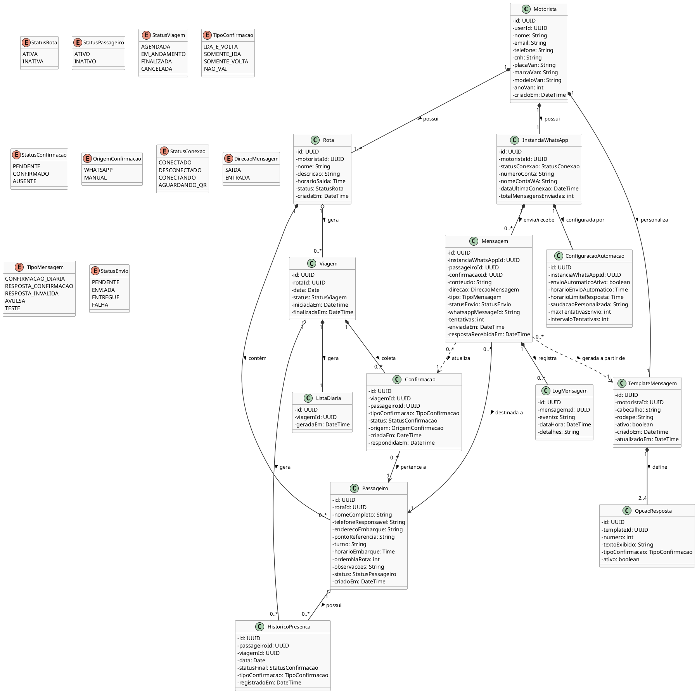

# BANCO.md — SmartRoutes

## Banco de dados: Supabase (PostgreSQL)

O banco principal do sistema é o **Supabase PostgreSQL**. Toda a autenticação é gerenciada pelo **Supabase Auth** (`auth.users`). A tabela `motoristas` referencia `auth.users.id` via `user_id` — nunca armazena senha ou token JWT.

O banco da Evolution API é separado e interno à biblioteca — a aplicação não acessa ele diretamente.

---

## Diagrama de Classes (PlantUML)

O diagrama abaixo representa a modelagem completa do sistema. Use-o como referência para entender os relacionamentos antes de ler o SQL.



---

## SQL completo — executar no Supabase SQL Editor

Execute os blocos abaixo **na ordem exata**. Cada bloco é independente e pode ser reexecutado com segurança graças ao `IF NOT EXISTS` e `OR REPLACE`.

### 1. Extensões necessárias

```sql
create extension if not exists "uuid-ossp";
```

---

### 2. ENUMs

```sql
create type status_rota as enum ('ativa', 'inativa');
create type status_passageiro as enum ('ativo', 'inativo');
create type status_viagem as enum ('agendada', 'em_andamento', 'finalizada', 'cancelada');
create type status_confirmacao as enum ('pendente', 'confirmado', 'ausente');
create type tipo_confirmacao as enum ('ida_e_volta', 'somente_ida', 'somente_volta', 'nao_vai');
create type origem_confirmacao as enum ('whatsapp', 'manual');
create type status_conexao as enum ('conectado', 'desconectado', 'conectando', 'aguardando_qr');
create type direcao_mensagem as enum ('saida', 'entrada');
create type tipo_mensagem as enum ('confirmacao_diaria', 'resposta_confirmacao', 'resposta_invalida', 'avulsa', 'teste');
create type status_envio as enum ('pendente', 'enviada', 'entregue', 'falha');
```

---

### 3. Tabela: motoristas

Vinculada ao Supabase Auth via `user_id`. Criada automaticamente quando o motorista faz o primeiro login.

```sql
create table if not exists motoristas (
  id          uuid primary key default uuid_generate_v4(),
  user_id     uuid not null unique references auth.users(id) on delete cascade,
  nome        text not null,
  email       text not null,
  telefone    text,
  cnh         text,
  criado_em   timestamptz not null default now()
);

comment on table motoristas is 'Perfil do motorista vinculado ao auth.users do Supabase.';
comment on column motoristas.user_id is 'FK para auth.users.id — nunca armazena senha ou token.';
```

---

### 4. Tabela: rotas

Modelo fixo de rota (ex: "Rota Manhã"). Não tem data — data pertence à viagem.

```sql
create table if not exists rotas (
  id              uuid primary key default uuid_generate_v4(),
  motorista_id    uuid not null references motoristas(id) on delete cascade,
  nome            text not null,
  descricao       text,
  horario_saida   time,
  status          status_rota not null default 'ativa',
  criada_em       timestamptz not null default now()
);

comment on table rotas is 'Modelo fixo de rota. Não contém data — instâncias diárias ficam em viagens.';
```

---

### 5. Tabela: passageiros

Vinculado à rota. `telefone_responsavel` é o número que receberá as mensagens WhatsApp.

```sql
create table if not exists passageiros (
  id                    uuid primary key default uuid_generate_v4(),
  rota_id               uuid not null references rotas(id) on delete cascade,
  nome_completo         text not null,
  telefone_responsavel  text not null,
  endereco_embarque     text not null,
  ponto_referencia      text,
  turno                 text,
  horario_embarque      time,
  ordem_na_rota         integer not null default 1,
  observacoes           text,
  status                status_passageiro not null default 'ativo',
  criado_em             timestamptz not null default now()
);

comment on table passageiros is 'Aluno vinculado a uma rota. telefone_responsavel recebe mensagens WhatsApp.';
comment on column passageiros.ordem_na_rota is 'Ordem de embarque dentro da rota (1 = primeiro a ser buscado).';
```

---

### 6. Tabela: viagens

Instância de uma rota em uma data específica. Criada quando o motorista aperta "iniciar rota".

```sql
create table if not exists viagens (
  id              uuid primary key default uuid_generate_v4(),
  rota_id         uuid not null references rotas(id) on delete cascade,
  data            date not null default current_date,
  status          status_viagem not null default 'em_andamento',
  iniciada_em     timestamptz not null default now(),
  finalizada_em   timestamptz,
  unique (rota_id, data)
);

comment on table viagens is 'Execução de uma rota em uma data específica. Uma rota pode ter no máximo uma viagem por dia.';
```

---

### 7. Tabela: listas_diarias

Gerada automaticamente ao iniciar uma viagem. Contém apenas metadados — os totais são calculados via query em confirmacoes.

```sql
create table if not exists listas_diarias (
  id          uuid primary key default uuid_generate_v4(),
  viagem_id   uuid not null unique references viagens(id) on delete cascade,
  gerada_em   timestamptz not null default now()
);

comment on table listas_diarias is 'Metadados da lista do dia. Totais de confirmados/pendentes/ausentes são calculados via query em confirmacoes — não armazenados aqui para evitar dessincronização.';
```

---

### 8. Tabela: confirmacoes

Coração do sistema. Uma confirmação por passageiro por viagem.

```sql
create table if not exists confirmacoes (
  id                  uuid primary key default uuid_generate_v4(),
  viagem_id           uuid not null references viagens(id) on delete cascade,
  passageiro_id       uuid not null references passageiros(id) on delete cascade,
  tipo_confirmacao    tipo_confirmacao,
  status              status_confirmacao not null default 'pendente',
  origem              origem_confirmacao,
  criada_em           timestamptz not null default now(),
  respondida_em       timestamptz,
  unique (viagem_id, passageiro_id)
);

comment on table confirmacoes is 'Uma confirmação por passageiro por viagem. Atualizada pelo webhook da Evolution API quando o responsável responde.';
comment on column confirmacoes.tipo_confirmacao is 'Preenchido quando status = confirmado. Null quando pendente ou ausente.';
```

---

### 9. Tabela: instancias_whatsapp

Uma instância por motorista. Armazena o estado da conexão com a Evolution API.

```sql
create table if not exists instancias_whatsapp (
  id                        uuid primary key default uuid_generate_v4(),
  motorista_id              uuid not null unique references motoristas(id) on delete cascade,
  status_conexao            status_conexao not null default 'desconectado',
  numero_conta              text,
  nome_conta_wa             text,
  data_ultima_conexao       timestamptz,
  total_mensagens_enviadas  integer not null default 0
);

comment on table instancias_whatsapp is 'Estado da conexão WhatsApp do motorista via Evolution API. Uma instância por motorista.';
```

---

### 10. Tabela: configuracoes_automacao

Configurações de envio automático vinculadas à instância WhatsApp.

```sql
create table if not exists configuracoes_automacao (
  id                        uuid primary key default uuid_generate_v4(),
  instancia_whatsapp_id     uuid not null unique references instancias_whatsapp(id) on delete cascade,
  envio_automatico_ativo    boolean not null default false,
  horario_envio_automatico  time,
  horario_limite_resposta   time,
  saudacao_personalizada    text,
  max_tentativas_envio      integer not null default 3,
  intervalo_tentativas      integer not null default 30
);

comment on table configuracoes_automacao is 'Configurações de automação do envio de mensagens. intervalo_tentativas em minutos.';
comment on column configuracoes_automacao.intervalo_tentativas is 'Intervalo entre tentativas de reenvio em minutos.';
comment on column configuracoes_automacao.horario_limite_resposta is 'Campo legado mantido por compatibilidade histórica. Não é mais usado como regra operacional desde a migration 20260513000000_remover_limite_resposta_logico.sql.';
```

---

### 11. Tabela: templates_mensagem

Mensagem personalizável pelo motorista. Cada motorista tem um template ativo.

```sql
create table if not exists templates_mensagem (
  id            uuid primary key default uuid_generate_v4(),
  motorista_id  uuid not null unique references motoristas(id) on delete cascade,
  cabecalho     text not null default 'Bom dia! Confirmação de presença na van escolar.',
  rodape        text not null default 'Responda com o número da opção desejada.',
  ativo         boolean not null default true,
  criado_em     timestamptz not null default now(),
  atualizado_em timestamptz not null default now()
);

comment on table templates_mensagem is 'Modelo de mensagem personalizável pelo motorista. Um template por motorista.';
```

---

### 12. Tabela: opcoes_resposta

As opções numeradas (1 a 4) dentro do template. Mapeiam para um tipo de confirmação.

```sql
create table if not exists opcoes_resposta (
  id                  uuid primary key default uuid_generate_v4(),
  template_id         uuid not null references templates_mensagem(id) on delete cascade,
  numero              integer not null check (numero between 1 and 4),
  texto_exibido       text not null,
  tipo_confirmacao    tipo_confirmacao not null,
  ativo               boolean not null default true,
  unique (template_id, numero)
);

comment on table opcoes_resposta is 'Opções numeradas do template. Cada número mapeia para um tipo_confirmacao.';
```

---

### 13. Tabela: mensagens

Log completo de todas as mensagens trocadas com a Evolution API (enviadas e recebidas).

```sql
create table if not exists mensagens (
  id                    uuid primary key default uuid_generate_v4(),
  instancia_whatsapp_id uuid references instancias_whatsapp(id) on delete set null,
  passageiro_id         uuid references passageiros(id) on delete set null,
  confirmacao_id        uuid references confirmacoes(id) on delete set null,
  conteudo              text not null,
  direcao               direcao_mensagem not null,
  tipo                  tipo_mensagem not null,
  status_envio          status_envio not null default 'pendente',
  whatsapp_message_id   text,
  tentativas            integer not null default 0,
  enviada_em            timestamptz not null default now(),
  resposta_recebida_em  timestamptz
);

comment on table mensagens is 'Histórico completo de mensagens enviadas e recebidas via Evolution API.';
comment on column mensagens.whatsapp_message_id is 'ID retornado pela Evolution API para rastreabilidade.';
```

---

### 14. Tabela: log_mensagens

Eventos de ciclo de vida de cada mensagem (enviada, entregue, falha, etc.).

```sql
create table if not exists log_mensagens (
  id            uuid primary key default uuid_generate_v4(),
  mensagem_id   uuid not null references mensagens(id) on delete cascade,
  evento        text not null,
  data_hora     timestamptz not null default now(),
  detalhes      text
);

comment on table log_mensagens is 'Log de eventos do ciclo de vida de cada mensagem.';
```

---

### 15. Tabela: conversas_confirmacao_whatsapp

Estado diário da conversa do responsável no WhatsApp. Essa tabela permite que
o webhook saiba se o responsável ainda não respondeu, já confirmou, está
decidindo se quer alterar ou está enviando uma nova escolha.

```sql
create table if not exists conversas_confirmacao_whatsapp (
  id uuid primary key default gen_random_uuid(),
  passageiro_id uuid not null references passageiros(id) on delete cascade,
  viagem_id uuid references viagens(id) on delete cascade,
  confirmacao_id uuid references confirmacoes(id) on delete cascade,
  data date not null default current_date,
  estado text not null default 'sem_resposta',
  tipo_confirmacao_anterior tipo_confirmacao,
  alterada boolean not null default false,
  criado_em timestamptz not null default now(),
  atualizado_em timestamptz not null default now(),
  unique (passageiro_id, data),
  constraint conversas_confirmacao_estado_check
    check (estado in (
      'sem_resposta',
      'confirmado',
      'aguardando_decisao',
      'aguardando_nova_resposta'
    ))
);
```

**Estados possíveis:**
- `sem_resposta` — confirmação do dia ainda não recebeu resposta válida
- `confirmado` — confirmação válida já registrada
- `aguardando_decisao` — responsável enviou nova opção e precisa decidir se altera
- `aguardando_nova_resposta` — responsável aceitou alterar e precisa enviar nova opção de 1 a 4

---

### 16. Tabela: historico_presenca

Desnormalização intencional para performance de relatórios. Evita varredura completa de confirmacoes.

```sql
create table if not exists historico_presenca (
  id                uuid primary key default uuid_generate_v4(),
  passageiro_id     uuid not null references passageiros(id) on delete cascade,
  viagem_id         uuid not null references viagens(id) on delete cascade,
  data              date not null,
  status_final      status_confirmacao not null,
  tipo_confirmacao  tipo_confirmacao,
  registrado_em     timestamptz not null default now(),
  unique (passageiro_id, viagem_id)
);

comment on table historico_presenca is 'Desnormalização intencional para relatórios de frequência. Preenchida automaticamente ao finalizar uma viagem.';
```

---

### 17. Índices para performance

```sql
create index if not exists idx_rotas_motorista_id on rotas(motorista_id);
create index if not exists idx_passageiros_rota_id on passageiros(rota_id);
create index if not exists idx_viagens_rota_id on viagens(rota_id);
create index if not exists idx_viagens_data on viagens(data);
create index if not exists idx_confirmacoes_viagem_id on confirmacoes(viagem_id);
create index if not exists idx_confirmacoes_passageiro_id on confirmacoes(passageiro_id);
create index if not exists idx_confirmacoes_status on confirmacoes(status);
create index if not exists idx_mensagens_confirmacao_id on mensagens(confirmacao_id);
create index if not exists idx_mensagens_passageiro_id on mensagens(passageiro_id);
create index if not exists idx_conversas_confirmacao_passageiro_data on conversas_confirmacao_whatsapp(passageiro_id, data);
create index if not exists idx_conversas_confirmacao_confirmacao_id on conversas_confirmacao_whatsapp(confirmacao_id);
create index if not exists idx_historico_passageiro_data on historico_presenca(passageiro_id, data);
```

---

### 18. Trigger: atualizar atualizado_em no template

```sql
create or replace function atualizar_timestamp()
returns trigger as $$
begin
  new.atualizado_em = now();
  return new;
end;
$$ language plpgsql;

create trigger trigger_template_atualizado
  before update on templates_mensagem
  for each row execute function atualizar_timestamp();
```

---

### 18. Trigger: popular historico_presenca ao finalizar viagem

```sql
create or replace function popular_historico_ao_finalizar()
returns trigger as $$
begin
  if new.status = 'finalizada' and old.status != 'finalizada' then
    insert into historico_presenca (passageiro_id, viagem_id, data, status_final, tipo_confirmacao)
    select
      c.passageiro_id,
      c.viagem_id,
      new.data,
      c.status,
      c.tipo_confirmacao
    from confirmacoes c
    where c.viagem_id = new.id
    on conflict (passageiro_id, viagem_id) do update
      set status_final = excluded.status_final,
          tipo_confirmacao = excluded.tipo_confirmacao;
  end if;
  return new;
end;
$$ language plpgsql;

create trigger trigger_finalizar_viagem
  after update on viagens
  for each row execute function popular_historico_ao_finalizar();
```

---

## Row Level Security (RLS)

Habilitar RLS em todas as tabelas. Motorista só acessa seus próprios dados.

```sql
-- Habilitar RLS em todas as tabelas
alter table motoristas enable row level security;
alter table rotas enable row level security;
alter table passageiros enable row level security;
alter table viagens enable row level security;
alter table listas_diarias enable row level security;
alter table confirmacoes enable row level security;
alter table instancias_whatsapp enable row level security;
alter table configuracoes_automacao enable row level security;
alter table templates_mensagem enable row level security;
alter table opcoes_resposta enable row level security;
alter table mensagens enable row level security;
alter table log_mensagens enable row level security;
alter table historico_presenca enable row level security;

-- motoristas: acessa apenas o próprio perfil
create policy "motorista_proprio_perfil" on motoristas
  for all using (user_id = auth.uid());

-- rotas: acessa apenas suas próprias rotas
create policy "motorista_proprias_rotas" on rotas
  for all using (
    motorista_id in (select id from motoristas where user_id = auth.uid())
  );

-- passageiros: acessa apenas passageiros das suas rotas
create policy "motorista_proprios_passageiros" on passageiros
  for all using (
    rota_id in (
      select r.id from rotas r
      join motoristas m on m.id = r.motorista_id
      where m.user_id = auth.uid()
    )
  );

-- viagens: acessa apenas viagens das suas rotas
create policy "motorista_proprias_viagens" on viagens
  for all using (
    rota_id in (
      select r.id from rotas r
      join motoristas m on m.id = r.motorista_id
      where m.user_id = auth.uid()
    )
  );

-- listas_diarias: acessa apenas listas das suas viagens
create policy "motorista_proprias_listas" on listas_diarias
  for all using (
    viagem_id in (
      select v.id from viagens v
      join rotas r on r.id = v.rota_id
      join motoristas m on m.id = r.motorista_id
      where m.user_id = auth.uid()
    )
  );

-- confirmacoes: acessa apenas confirmações das suas viagens
create policy "motorista_proprias_confirmacoes" on confirmacoes
  for all using (
    viagem_id in (
      select v.id from viagens v
      join rotas r on r.id = v.rota_id
      join motoristas m on m.id = r.motorista_id
      where m.user_id = auth.uid()
    )
  );

-- instancias_whatsapp: acessa apenas a própria instância
create policy "motorista_propria_instancia" on instancias_whatsapp
  for all using (
    motorista_id in (select id from motoristas where user_id = auth.uid())
  );

-- configuracoes_automacao: acessa apenas a própria configuração
create policy "motorista_propria_configuracao" on configuracoes_automacao
  for all using (
    instancia_whatsapp_id in (
      select i.id from instancias_whatsapp i
      join motoristas m on m.id = i.motorista_id
      where m.user_id = auth.uid()
    )
  );

-- templates_mensagem: acessa apenas o próprio template
create policy "motorista_proprio_template" on templates_mensagem
  for all using (
    motorista_id in (select id from motoristas where user_id = auth.uid())
  );

-- opcoes_resposta: acessa apenas opções do próprio template
create policy "motorista_proprias_opcoes" on opcoes_resposta
  for all using (
    template_id in (
      select t.id from templates_mensagem t
      join motoristas m on m.id = t.motorista_id
      where m.user_id = auth.uid()
    )
  );

-- mensagens: acessa apenas mensagens dos seus passageiros
create policy "motorista_proprias_mensagens" on mensagens
  for all using (
    passageiro_id in (
      select p.id from passageiros p
      join rotas r on r.id = p.rota_id
      join motoristas m on m.id = r.motorista_id
      where m.user_id = auth.uid()
    )
  );

-- log_mensagens: acessa apenas logs das suas mensagens
create policy "motorista_proprios_logs" on log_mensagens
  for all using (
    mensagem_id in (
      select ms.id from mensagens ms
      join passageiros p on p.id = ms.passageiro_id
      join rotas r on r.id = p.rota_id
      join motoristas m on m.id = r.motorista_id
      where m.user_id = auth.uid()
    )
  );

-- historico_presenca: acessa apenas histórico dos seus passageiros
create policy "motorista_proprio_historico" on historico_presenca
  for all using (
    passageiro_id in (
      select p.id from passageiros p
      join rotas r on r.id = p.rota_id
      join motoristas m on m.id = r.motorista_id
      where m.user_id = auth.uid()
    )
  );
```

---

## Realtime — tabelas que o frontend escuta

Habilitar Realtime nas tabelas que precisam de atualização ao vivo no PWA.

```sql
-- Executar no Supabase Dashboard > Database > Replication
-- Ou via SQL:
alter publication supabase_realtime add table confirmacoes;
alter publication supabase_realtime add table viagens;
alter publication supabase_realtime add table instancias_whatsapp;
```

O frontend escuta `confirmacoes` para atualizar o status dos passageiros em tempo real quando o webhook da Evolution API recebe uma resposta.

---

## Dados iniciais (seed)

Ao criar um motorista, criar automaticamente a instância WhatsApp, template padrão e opções de resposta padrão.

```sql
-- Função chamada pela Edge Function após o primeiro login do motorista
create or replace function criar_dados_iniciais_motorista(p_motorista_id uuid)
returns void as $$
declare
  v_instancia_id uuid;
  v_template_id uuid;
begin
  -- Cria instância WhatsApp
  insert into instancias_whatsapp (motorista_id)
  values (p_motorista_id)
  returning id into v_instancia_id;

  -- Cria configuração de automação padrão
  insert into configuracoes_automacao (instancia_whatsapp_id)
  values (v_instancia_id);

  -- Cria template de mensagem padrão
  insert into templates_mensagem (motorista_id, cabecalho, rodape)
  values (
    p_motorista_id,
    'Bom dia! Confirmação de presença na van escolar para hoje.',
    'Aguardo sua resposta. Obrigado!'
  )
  returning id into v_template_id;

  -- Cria as 4 opções de resposta padrão
  insert into opcoes_resposta (template_id, numero, texto_exibido, tipo_confirmacao) values
    (v_template_id, 1, 'Ida e volta', 'ida_e_volta'),
    (v_template_id, 2, 'Somente ida', 'somente_ida'),
    (v_template_id, 3, 'Somente volta', 'somente_volta'),
    (v_template_id, 4, 'Não vai hoje', 'nao_vai');
end;
$$ language plpgsql security definer;
```

---

## Resumo das tabelas

| Tabela | Descrição | Linhas estimadas |
|---|---|---|
| `motoristas` | Perfil do motorista + preferências (notif, idioma, dados do veículo) | Baixo |
| `rotas` | Modelos fixos de rota | Baixo |
| `passageiros` | Alunos por rota | Médio |
| `viagens` | Execuções diárias das rotas | Cresce diariamente |
| `listas_diarias` | Uma por viagem | Cresce diariamente |
| `confirmacoes` | Uma por passageiro por viagem | Alto volume |
| `instancias_whatsapp` | Uma por motorista | Baixo |
| `configuracoes_automacao` | Uma por instância | Baixo |
| `templates_mensagem` | Um por motorista | Baixo |
| `opcoes_resposta` | 2 a 4 por template | Baixo |
| `mensagens` | Histórico completo WhatsApp | Alto volume |
| `log_mensagens` | Eventos por mensagem | Alto volume |
| `historico_presenca` | Desnormalização para relatórios | Alto volume |
| `notificacoes` | Notificações in-app do motorista (sino do dashboard) | Médio |

---

## Histórico de migrations aplicadas

Lista cronológica das migrations em `supabase/migrations/`, do mais antigo
para o mais novo. Todas já foram aplicadas no remoto via `supabase db push`.

| Arquivo | O que faz |
|---|---|
| `20260427000000_initial_schema.sql` | Schema inicial (todas as tabelas + RLS + função `criar_dados_iniciais_motorista`) |
| `20260429000000_grants_authenticated.sql` | `GRANT select/insert/update/delete` para `authenticated` em todas as tabelas (necessário porque RLS sozinho não basta no Postgres) |
| `20260430000000_paradas_rota.sql` | Adiciona `ponto_saida_*` em `rotas` + tabela `paradas_rota` (depois substituída por `destinos` JSONB) |
| `20260430010000_endereco_estruturado.sql` | Estruturação do endereço de origem da rota |
| `20260430020000_destinos_em_rotas.sql` | Coluna `destinos JSONB` em `rotas` substituindo `paradas_rota` |
| `20260501000000_endereco_estruturado_passageiro.sql` | Quebra `endereco_embarque` em `embarque_rua`, `embarque_numero`, `embarque_bairro`, `embarque_cep` |
| `20260501010000_observacoes_jsonb.sql` | `passageiros.observacoes` vira JSONB (`tipoPassageiro`, `instituicao`, `serieSemestre`, `curso`, `nomeResponsavel`) |
| `20260501020000_drop_endereco_embarque.sql` | Remove a coluna legada `endereco_embarque` |
| `20260506000000_motoristas_dados_veiculo.sql` | Adiciona `placa_van`, `marca_van`, `modelo_van`, `ano_van` em `motoristas` |
| `20260507000000_notificacoes.sql` | Cria enum `tipo_notificacao` + tabela `notificacoes` + RLS + Realtime |
| `20260509000000_motoristas_preferencias.sql` | Adiciona `notif_whatsapp`, `notif_push`, `notif_pendentes`, `som_alerta`, `idioma` em `motoristas` |
| `20260510000000_grants_service_role.sql` | `GRANT all` para `service_role` + `ALTER DEFAULT PRIVILEGES` (fix do erro 42501 em Edge Functions que usam `criarClienteServico`) |
| `20260510010000_saudacao_template.sql` | `DEFAULT` do `templates_mensagem.cabecalho` passa a usar `{saudacao}`; sobrescreve templates antigos no formato padrão exato; reescreve `criar_dados_iniciais_motorista` |

---

## Estado atual da tabela `motoristas`

Depois de todas as migrations, a tabela tem mais colunas que o snapshot do
schema inicial mostra. Versão consolidada (apenas para referência):

```sql
create table motoristas (
  id              uuid primary key default uuid_generate_v4(),
  user_id         uuid not null unique references auth.users(id) on delete cascade,
  nome            text not null,
  email           text not null,
  telefone        text,
  cnh             text,
  -- veículo (20260506)
  placa_van       text,
  marca_van       text,
  modelo_van      text,
  ano_van         integer,
  -- preferências (20260509)
  notif_whatsapp  boolean not null default true,
  notif_push      boolean not null default true,
  notif_pendentes boolean not null default false,
  som_alerta      text not null default 'default',
  idioma          text not null default 'pt-BR',
  criado_em       timestamptz not null default now()
);
```

---

## Tabela `notificacoes` (migration 20260507)

Notificações in-app que aparecem no sino do dashboard. INSERT é restrito ao
`service role` (somente Edge Functions criam) — motoristas podem ler/atualizar
apenas as suas via RLS.

```sql
create type tipo_notificacao as enum (
  'whatsapp_resposta',
  'viagem_iniciada',
  'viagem_finalizada'
);

create table notificacoes (
  id            uuid primary key default gen_random_uuid(),
  motorista_id  uuid not null references motoristas(id) on delete cascade,
  titulo        text not null,
  mensagem      text not null,
  tipo          tipo_notificacao not null,
  lida          boolean not null default false,
  criada_em     timestamptz not null default now()
);

-- INSERT só via service role; SELECT/UPDATE para o dono
alter table notificacoes enable row level security;
grant select, update on notificacoes to authenticated;

-- Adicionada ao Realtime para o frontend ouvir mudanças em tempo real
alter publication supabase_realtime add table notificacoes;
```

Quem cria notificações:
- `webhook-evolution` → `whatsapp_resposta` (quando o pai responde no WhatsApp)
- `_shared/viagem.ts` (chamada por `iniciar-viagem` / `automacao-diaria`) → `viagem_iniciada`
- `finalizar-viagem` → `viagem_finalizada`

---

## Decisão arquitetural: `confirmado + nao_vai` é semanticamente "não vai hoje"

A coluna `confirmacoes.status` admite `pendente`, `confirmado`, `ausente`. A
`tipo_confirmacao` admite `ida_e_volta`, `somente_ida`, `somente_volta`,
`nao_vai`. A combinação **`status='confirmado' + tipo_confirmacao='nao_vai'`**
significa que o responsável **respondeu** dizendo que NÃO vai — semanticamente
é equivalente a `ausente` na UI.

Para evitar divergências entre telas, o frontend usa
`src/app/utils/confirmacaoStatus.ts::statusUIDaConfirmacao(status, tipo)` que
retorna um status único de UI:

| `status` + `tipo` no banco | `StatusUI` |
|---|---|
| `pendente` (qualquer) | `pendente` |
| `confirmado + ida_e_volta`/`somente_ida`/`somente_volta` | `vai` |
| `confirmado + nao_vai` | `nao_vai_hoje` |
| `ausente` | `nao_vai_hoje` |

Use esse helper em qualquer tela nova que precise classificar o aluno como
vai / não vai / pendente.

---

## Grants para `service_role`

A migration `20260510000000_grants_service_role.sql` concede `select/insert/
update/delete` em todas as tabelas + `usage/select/update` em sequences +
`execute` em functions para o role `service_role`. Também usa `ALTER DEFAULT
PRIVILEGES` para tabelas futuras herdarem o grant automaticamente.

**Por que isso é necessário:** as Edge Functions que usam `criarClienteServico()`
(`webhook-evolution`, `automacao-diaria`, `qr-code-whatsapp`,
`status-whatsapp`, `verificar-whatsapp`, `desconectar-whatsapp`) bypassam RLS
mas **ainda precisam** ter o GRANT na tabela — caso contrário o Postgres
barra com `42501: permission denied for table X`. Esse foi o erro que
travou o fluxo de QR Code antes da migration ser aplicada.


