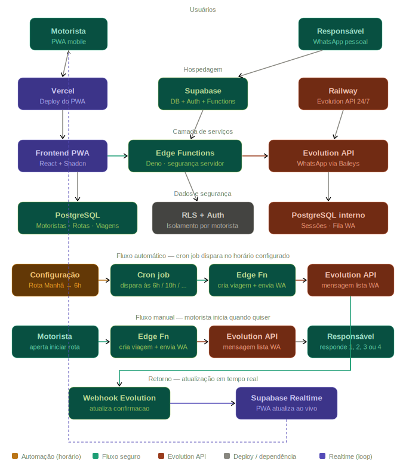

# Arquitetura do Sistema — SmartRoute

## Diagrama



---

## Visão geral

O SmartRoute é um PWA mobile-first 100% frontend que se integra com dois serviços externos: o **Supabase** (banco de dados, autenticação e funções serverless) e a **Evolution API** (integração com WhatsApp). A arquitetura foi desenhada com uma camada de segurança intermediária — as **Edge Functions** — que garante que as credenciais de acesso ao WhatsApp nunca sejam expostas ao navegador.

---

## Camadas da arquitetura

### Usuários

O sistema tem dois tipos de usuário com papéis completamente distintos:

- **Motorista** — acessa o PWA para gerenciar passageiros, rotas e acompanhar confirmações em tempo real.
- **Responsável pelo aluno** — não tem acesso ao sistema. Interage exclusivamente pelo WhatsApp que já utiliza no dia a dia, sem necessidade de instalar nada.

### Hospedagem

Três serviços gerenciados, sem servidor próprio para configurar:

- **Vercel** — hospeda e faz o deploy automático do frontend PWA a cada push no GitHub. Inclui CDN global e HTTPS sem configuração.
- **Supabase** — plataforma que provê banco de dados PostgreSQL, autenticação de usuários, Edge Functions e Realtime em um único serviço gerenciado.
- **Railway** — hospeda a Evolution API com processo Node.js persistente 24 horas por dia, necessário para manter a sessão WhatsApp ativa.

### Camada de serviços

Esta é a camada mais importante do ponto de vista de segurança:

- **Frontend PWA** — construído em React 18 + TypeScript + Tailwind. Acessa o Supabase diretamente para leitura de dados (protegida por RLS) e chama as Edge Functions para operações que envolvem WhatsApp.
- **Edge Functions** — funções TypeScript rodando no servidor Supabase (runtime Deno). Atuam como intermediário seguro entre o frontend e a Evolution API. A API key do WhatsApp fica armazenada apenas aqui, nunca chegando ao navegador.
- **Evolution API** — serviço que expõe o WhatsApp como API REST, usando o protocolo Baileys internamente. Recebe comandos das Edge Functions e envia eventos de volta via webhook.

### Dados e segurança

- **PostgreSQL (Supabase)** — banco principal do sistema com as tabelas: motoristas, rotas, passageiros, viagens, confirmações, templates, histórico e logs.
- **RLS + Auth** — Row Level Security ativo em todas as tabelas. Cada motorista acessa exclusivamente seus próprios dados, mesmo que tente consultar o banco diretamente.
- **PostgreSQL interno (Evolution API)** — banco gerenciado internamente pela própria biblioteca para armazenar sessões WhatsApp e filas de mensagens. A aplicação não acessa este banco diretamente — é uma dependência técnica da ferramenta.

---

## Fluxo principal — confirmação de presença

O fluxo central do sistema ocorre em seis etapas:

1. **Motorista inicia a rota** no PWA, acionando o botão de início de viagem.
2. **Edge Function `iniciar-viagem`** é chamada pelo frontend. Ela cria o registro da viagem no banco, busca os passageiros ativos da rota e chama a Evolution API com as credenciais protegidas.
3. **Evolution API envia a mensagem de lista** para o WhatsApp de cada responsável, com opções numeradas de 1 a 4 para confirmação.
4. **Responsável responde** tocando em uma das opções na mensagem recebida.
5. **Edge Function `webhook-evolution`** recebe a resposta via webhook da Evolution API, valida o secret de autenticação e atualiza o status da confirmação no banco de dados.
6. **Supabase Realtime** notifica o frontend instantaneamente, atualizando a lista de confirmações no PWA do motorista sem necessidade de recarregar a página.

---

## Decisão de segurança — por que as Edge Functions existem

Sem a camada intermediária, o fluxo seria:

```
Frontend → Evolution API (direto)
```

Isso exporia a API key da Evolution API no bundle JavaScript do navegador, permitindo que qualquer pessoa a extraísse pelo DevTools e enviasse mensagens pelo número do motorista sem autorização.

Com as Edge Functions, o fluxo correto é:

```
Frontend → Edge Functions (JWT validado) → Evolution API (API key no servidor)
```

Além da proteção da API key, as Edge Functions centralizam as regras de negócio — validam se a rota pertence ao motorista autenticado antes de qualquer operação, impedindo acesso cruzado entre contas.

---

## Dois bancos PostgreSQL — esclarecimento

O sistema utiliza dois bancos com responsabilidades completamente distintas:

| Banco | Responsabilidade | Gerenciado por |
|---|---|---|
| Supabase PostgreSQL | Dados do domínio da aplicação | A equipe do projeto |
| Evolution API PostgreSQL | Infraestrutura interna de mensageria | A própria biblioteca |

A existência de dois bancos não foi uma escolha de modelagem — é uma consequência técnica do uso da Evolution API, que requer banco próprio para funcionar. Os dois bancos nunca se comunicam diretamente.